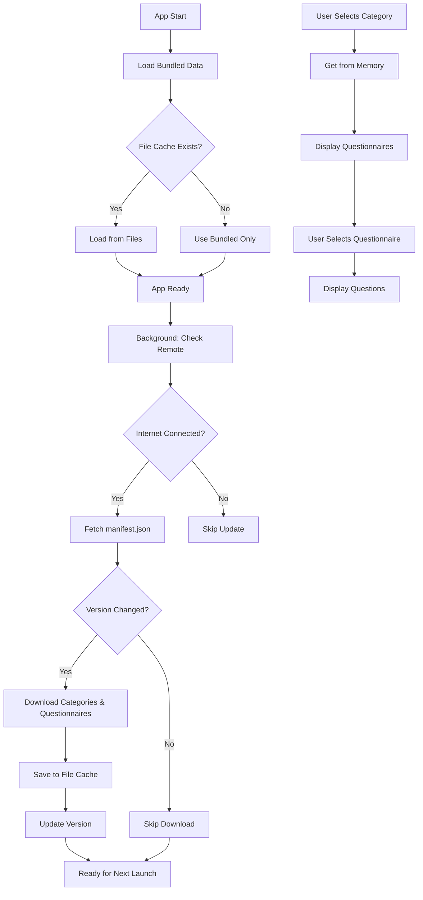

# Questionnaire Loading Architecture

## Overview

SDSA uses a simple, efficient approach to questionnaire loading:
1. **App ships with complete default questionnaires** - Users can start immediately
2. **Background sync from remote repository** - Updates cached when online  
3. **All questionnaires loaded at once** - No per-question fetching, everything is pre-loaded

## Data Source Strategy

### Simple Priority Chain
1. **File Cache** - If exists, use the latest downloaded version
2. **Bundled Assets** - Default questionnaires shipped with the app (always available)

Remote fetching happens in background and updates the cache for next app launch.

## Questionnaire Structure

### JSON Format - Complete Example

```json
{
  "id": "e2e-testing",
  "title": "E2E Testing Setup",
  "description": "Help configure end-to-end testing for your project",
  "questions": [
    {
      "type": "radio",
      "label": "Do you have an existing test system?",
      "options": [
        {
          "value": "yes",
          "label": "Yes, I have a test system"
        },
        {
          "value": "no",
          "label": "No, starting from scratch"
        }
      ]
    },
    {
      "type": "radio",
      "label": "Which framework are you using?",
      "options": [
        {
          "value": "cypress",
          "label": "Cypress"
        },
        {
          "value": "playwright",
          "label": "Playwright"
        },
        {
          "value": "selenium",
          "label": "Selenium"
        },
        {
          "value": "other",
          "label": "Other",
          "hasTextInput": true,
          "textInputPlaceholder": "Please specify..."
        }
      ]
    },
    {
      "type": "checkbox",
      "label": "Which features do you need?",
      "options": [
        {
          "value": "parallel",
          "label": "Parallel Execution"
        },
        {
          "value": "ci_integration",
          "label": "CI/CD Integration"
        },
        {
          "value": "reporting",
          "label": "Test Reporting"
        },
        {
          "value": "visual_testing",
          "label": "Visual Testing"
        },
        {
          "value": "other_features",
          "label": "Other",
          "hasTextInput": true,
          "textInputPlaceholder": "Specify other features..."
        }
      ]
    },
    {
      "type": "text",
      "label": "What is your primary testing goal?",
      "placeholder": "e.g., regression testing, user journey validation..."
    },
    {
      "type": "textarea",
      "label": "Describe any specific requirements or constraints",
      "placeholder": "Enter detailed requirements..."
    }
  ],
  "llmConfig": {
    "systemPrompt": "You are an expert in E2E testing frameworks. Based on the user's answers, provide specific, actionable recommendations for setting up their testing infrastructure.",
    "temperature": 0.7,
    "maxTokens": 1500
  },
  "metadata": {
    "author": "eugene-taran",
    "version": "1.2.0",
    "last_updated": "2024-12-15",
    "estimatedTime": "5-10 minutes",
    "difficulty": "intermediate",
    "tags": ["testing", "e2e", "automation"]
  }
}
```

### How the JSON Structure Works:

1. **Flat question array** - All questions in a single array, no nesting
2. **Four question types** - `text`, `textarea`, `radio`, `checkbox`
3. **Options with custom input** - Any option can have `hasTextInput: true` for additional text
4. **LLM configuration** - System prompt and parameters for AI processing
5. **Answer collection** - Each question's answer is stored with the question index
6. **Metadata** - Author attribution and questionnaire info

### TypeScript Types
```typescript
interface Questionnaire {
  id: string;
  title: string;
  description: string;
  questions: Question[];
  llmConfig: LLMConfig;
  metadata?: Metadata;
}

interface Question {
  type: 'text' | 'textarea' | 'radio' | 'checkbox';
  label: string;
  placeholder?: string;
  options?: Option[];
}

interface Option {
  value: string;
  label: string;
  hasTextInput?: boolean;
  textInputPlaceholder?: string;
}

interface LLMConfig {
  systemPrompt: string;
  temperature: number;
  maxTokens: number;
}
```

## Category Organization

### Categories Structure
```json
{
  "categories": [
    {
      "id": "testing",
      "name": "Testing",
      "description": "Testing strategies and frameworks",
      "icon": "🧪",
      "path": "testing",
      "order": 1
    },
    {
      "id": "cicd",
      "name": "CI/CD",
      "description": "Continuous Integration and Deployment",
      "icon": "🚀",
      "path": "cicd",
      "order": 2
    },
    {
      "id": "frontend",
      "name": "Frontend",
      "description": "Frontend frameworks and tools",
      "icon": "💻",
      "path": "frontend",
      "order": 3
    }
  ]
}
```

## Implementation Architecture

### 1. Bundled Content Structure
```
assets/
└── contexts/
    ├── categories.json       # Category metadata
    ├── manifest.json         # Version info
    └── categories/
        ├── testing/
        │   ├── e2e-testing.json
        │   └── unit-testing.json
        ├── cicd/
        │   ├── github-actions.json
        │   └── gitlab-ci.json
        └── frontend/
            ├── react-setup.json
            └── vue-setup.json
```

### 2. Simplified Service Architecture

#### QuestionnaireService (Single Service)
```typescript
class QuestionnaireService {
  private fileCache: Map<string, any> = new Map();
  private bundledData: Map<string, any> = new Map();
  
  async initialize() {
    // Load all bundled data on app start
    await this.loadBundledData();
    // Load cached data if exists
    await this.loadCachedData();
    // Trigger background sync
    this.backgroundSync();
  }
  
  getQuestionnaire(categoryId: string, questionnaireId: string): Questionnaire {
    const key = `${categoryId}/${questionnaireId}`;
    // Try file cache first, then bundled
    return this.fileCache.get(key) || this.bundledData.get(key);
  }
  
  getCategories(): Category[] {
    return this.fileCache.get('categories') || this.bundledData.get('categories');
  }
  
  private async backgroundSync() {
    // Fetch all data from remote
    // Save to file system
    // Update cache for next launch
  }
}
```

### 3. Category Discovery System

#### CategoryService
```typescript
class CategoryService {
  constructor(private questionnaireService: QuestionnaireService) {}
  
  async getCategories(): Promise<Category[]> {
    return this.questionnaireService.getCategories();
  }
  
  async getQuestionnairesForCategory(categoryId: string): Promise<Questionnaire[]> {
    const category = this.getCategories().find(c => c.id === categoryId);
    if (!category) return [];
    
    // Load all questionnaires for this category
    const files = await this.listQuestionnaireFiles(category.path);
    return Promise.all(files.map(f => this.questionnaireService.getQuestionnaire(category.path, f)));
  }
  
  searchQuestionnaires(query: string): Questionnaire[] {
    // Search across all categories
    return this.getAllQuestionnaires().filter(q => 
      q.title.toLowerCase().includes(query.toLowerCase()) ||
      q.description.toLowerCase().includes(query.toLowerCase())
    );
  }
}
```

### 4. Simple Caching Strategy

#### Two-Layer Cache
1. **Memory Map** - All questionnaires loaded in memory on app start
2. **File System** - Downloaded updates stored as files

#### Simple File Structure
- Categories file: `categories.json`
- Questionnaires: `categories/testing/e2e-testing.json`
- Manifest: `manifest.json`

### 5. Simplified Loading Flow



### 6. Version-Based Sync Mechanism

#### Manifest File (in sdsa.team repo)
```json
{
  "version": "2024.12.15.1",
  "timestamp": "2024-12-15T10:30:00Z",
  "checksum": "abc123def456",
  "stats": {
    "categories": 8,
    "questionnaires": 45,
    "totalSize": "156KB"
  }
}
```

#### Smart Update Check
```typescript
class QuestionnaireService {
  private currentVersion: string = null;
  
  async checkForUpdates(): Promise<boolean> {
    // 1. Fetch only the manifest.json (small file)
    const manifest = await fetch(`${REMOTE_URL}/manifest.json`);
    
    // 2. Compare versions
    if (manifest.version === this.currentVersion) {
      return false; // No update needed
    }
    
    // 3. Download questionnaires only if version changed
    await this.downloadAllContent();
    this.currentVersion = manifest.version;
    return true;
  }
}
```

#### Sync Process
1. Fetch lightweight manifest file (< 1KB)
2. Compare version with stored version
3. If different, download categories and questionnaires
4. Save new version to storage
5. No download if version unchanged

### 7. Answer Collection & Processing

#### Answer State Management
```typescript
interface AnswerState {
  questionnaireId: string;
  categoryId: string;
  answers: Answer[];
  startedAt: Date;
  completedAt?: Date;
}

interface Answer {
  questionIndex: number;
  type: string;
  value: string | string[]; // string for text/radio, array for checkbox
  customText?: string; // For options with hasTextInput
}
```

#### Processing Answers for LLM
```typescript
function prepareContextForLLM(questionnaire: Questionnaire, answers: Answer[]): string {
  const context = {
    questionnaire: questionnaire.title,
    responses: answers.map((a, i) => ({
      question: questionnaire.questions[i].label,
      answer: formatAnswer(a)
    }))
  };
  
  return `${questionnaire.llmConfig.systemPrompt}\n\nUser Context:\n${JSON.stringify(context, null, 2)}`;
}
```

### 8. Error Handling

#### Network Failures
- Automatic fallback to cache/bundled
- Retry with exponential backoff
- User notification for persistent failures

#### Parsing Errors
- Validate JSON structure
- Schema validation with Joi/Yup
- Graceful degradation to previous version

#### Missing Questionnaires
- Placeholder content
- Link to online version
- Request queuing for retry

## File System Access

### React Native Asset Loading

#### For Bundled JSON Files
```typescript
import { Asset } from 'expo-asset';

async function loadBundledJSON(path: string): Promise<any> {
  const asset = Asset.fromModule(require(`../assets/contexts/${path}`));
  await asset.downloadAsync();
  const response = await fetch(asset.uri);
  return response.json();
}
```

#### For Dynamic Loading
```typescript
import * as FileSystem from 'expo-file-system';

async function loadFromFileSystem(path: string): Promise<any> {
  const fileUri = `${FileSystem.documentDirectory}contexts/${path}`;
  const content = await FileSystem.readAsStringAsync(fileUri);
  return JSON.parse(content);
}
```

## Migration Path

### Phase 1: Bundled Content (MVP)
- Ship with essential questionnaires
- Basic category organization
- No remote fetching

### Phase 2: Remote Integration
- Enable GitHub fetching
- Add caching layer
- Background sync

### Phase 3: Community Features
- User contributions via PRs
- Rating and feedback
- Custom questionnaires

### Phase 4: Advanced Features
- Conditional questions (show/hide based on answers)
- Multi-step questionnaires
- Progress tracking
- Analytics

## Security Considerations

### Content Validation
- JSON sanitization
- Input validation
- Size limits for questionnaires
- Rate limiting for fetches

### Privacy
- No user tracking in MVP
- Local-only answer history
- Opt-in telemetry (future)

## Performance Optimization

### Bundle Size
- Lazy load questionnaires
- Compress JSON files
- Optimize for minimal payload

### Runtime Performance
- Memory cache with LRU eviction
- Prefetch likely questionnaires
- Progressive loading

### Network Optimization
- HTTP/2 for parallel fetches
- ETag support for caching
- Delta updates (future)

## Testing Strategy

### Unit Tests
- Service implementations
- Cache operations
- JSON parsing
- Fallback logic

### Integration Tests
- Full loading flow
- Offline scenarios
- Sync mechanism
- Error recovery

### E2E Tests
- Category browsing
- Questionnaire completion
- Answer submission
- Offline mode

## Development Setup

### Local Testing
```bash
# Start with mock data
QUESTIONNAIRE_SOURCE=mock yarn start

# Use bundled assets
QUESTIONNAIRE_SOURCE=bundled yarn start

# Use remote (requires sdsa.team repo)
QUESTIONNAIRE_SOURCE=remote yarn start
```

### Adding New Questionnaires
1. Create JSON file in `assets/contexts/categories/{category}/`
2. Update `categories.json` if new category
3. Test loading flow
4. Submit PR to sdsa.team repo

## Future Enhancements

### Version 2.0
- Conditional questions
- Question dependencies
- Multi-language support
- Rich media in questions

### Version 3.0
- AI-generated questionnaires
- Collaborative editing
- Real-time updates
- Federation support

## API Reference

### QuestionnaireService

```typescript
class QuestionnaireService {
  // Get a questionnaire
  getQuestionnaire(categoryId: string, questionnaireId: string): Promise<Questionnaire>
  
  // Get all categories
  getCategories(): Promise<Category[]>
  
  // Get questionnaires for category
  getQuestionnairesForCategory(categoryId: string): Promise<Questionnaire[]>
  
  // Check for updates
  checkForUpdates(): Promise<UpdateInfo>
  
  // Force sync
  syncContent(): Promise<void>
  
  // Clear cache
  clearCache(): Promise<void>
}
```

### CategoryService

```typescript
class CategoryService {
  // Get all categories
  getAllCategories(): Promise<Category[]>
  
  // Get category by ID
  getCategory(categoryId: string): Promise<Category>
  
  // Search questionnaires
  searchQuestionnaires(query: string): Promise<Questionnaire[]>
  
  // Get popular questionnaires
  getPopularQuestionnaires(limit: number): Promise<Questionnaire[]>
}
```

## Monitoring & Analytics

### Metrics to Track (Post-MVP)
- Questionnaire load times
- Cache hit rates
- Sync frequency
- Error rates
- Popular categories
- Completion rates

### Error Reporting
- Sentry integration
- Custom error boundaries
- Fallback UI states
- User feedback mechanism

## Conclusion

This architecture provides a robust, offline-first approach to loading questionnaires while maintaining flexibility for future enhancements. The fallback chain ensures users always have access to content, while the sync mechanism keeps content fresh when connectivity is available.